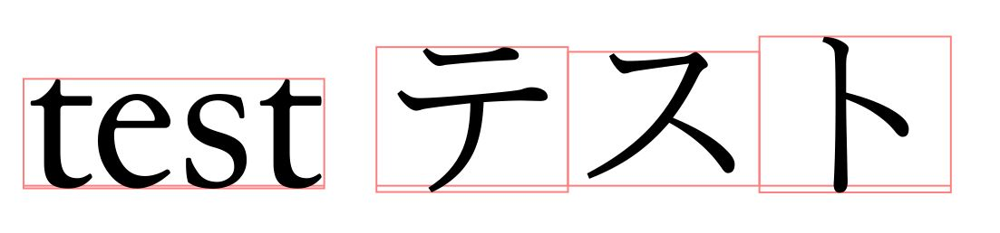
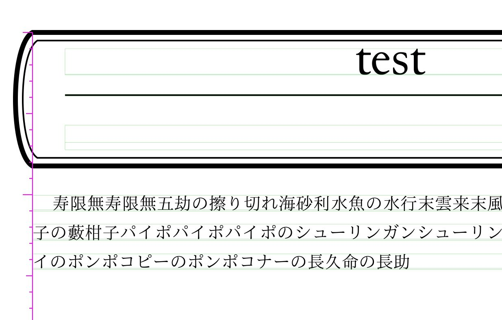
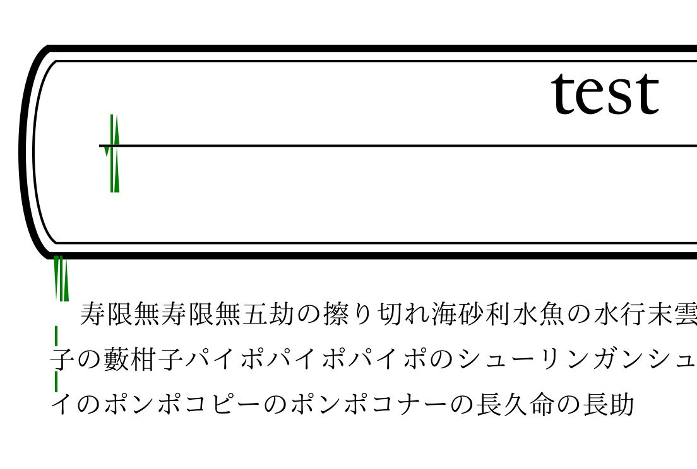

# デバッグオプションの使い方

SATySFiでは、「スペースがどう入っているのか」などの情報をPDFに直接表示させるデバッグのためのオプションがあります。

直接PDFに描画するため、印刷・配布用のPDFを生成する際には使えませんが、SATySFi本体の改造やパッケージの作成を行っている際にはとても便利な機能です。

また、SATySFi本体が提供している機能であるため、「デバッグオプションを使ったときと使わなかったときとで分割位置が変化した」といった現象は発生しません。

v0.0.5時点でデバッグオプションは4つあり、v0.0.6で5つ目が入る予定です。

v0.0.5で提供されているのは

- `--debug-show-bbox`
- `--debug-show-space`
- `--debug-show-block-bbox`
- `--debug-show-block-space`

で、v0.0.6で入る予定（2020/12/19にHEAD版に追加）のオプションは

- `--debug-show-overfull`

です。

どれも、起動時に付けるだけで有効になります。引数は必要ありません。

それでは、一つずつ役割や出力結果の見方などについて説明していきます。

## `--debug-show-bbox`

文字やブロックの枠を薄い赤色の枠で表示します。

また、ベースラインも同じ色の線で表示されます。

## `--debug-show-space`

文字やブロック間のスペースを青い枠で表示します。

## `--debug-show-block-bbox`

行が薄い緑色の枠で囲われ、テキストが入る領域の高さを表示するピンクの線が左側に付きます。

## `--debug-show-block-space`

高さ関係のスペースが濃い緑色の線と三角形で表示されます。

段落間のスペースが三角形で表示され、より大きい方のスペースが採用されていることがわかります。
行間が細めの緑色の線です。

## `--debug-show-overfull`

overfullやunderfullを起こした行に赤い枠が付きます。

